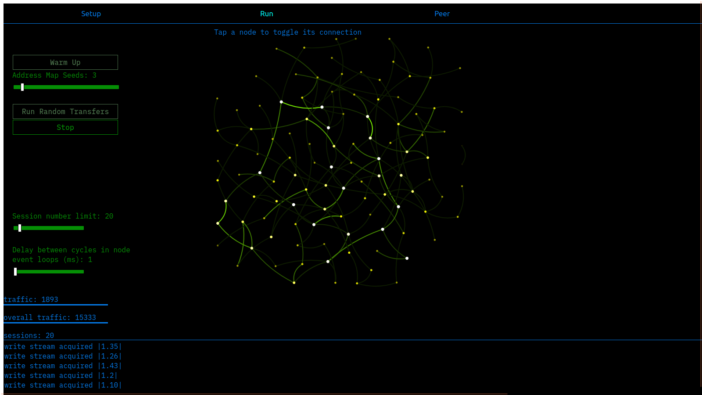

 # Mockwork
 ## Asynchronous Network Simulator.
 [Run Demo](https://retamogordo.github.io/mockwork-site)
 ### Introduction
This program offers a simulation of nodes connected via physical media. 
These nodes operate with a protocol stack that enables the exchange of data among them. 
The code is designed to run on WebAssembly, which is then loaded onto a single JS Web Worker.
 
 
 
 ### Building and running locally
 - clone the repo
 - in ```/www``` folder run ```npm install```
 - run ```npm run start``` (or ```npm run build``` to bundle to ```www/dist```)
 - change dir to ```/crate-wasm``` and run ```wasm-pack build``` 
 - access in a browser from ```localhost:8080```

 ### Disclaimer
This program was created as a part of my endeavor to familiarize myself with the Rust programming language. 

The architecture of this network is not derived from any existing real-world network implementation. 
All the terminology employed here, such as socket, peer, stream, protocol, and so on, should be interpreted in a broad and abstract manner.

Although it may appear somewhat intricate, this program does not aim to serve any practical purpose but rather consumes CPU resources when executed. :)
 
 ### Brief introduction to functioning
 
 Nodes are linked by duplex lines, which are represented by only a few parameters: propagation delay and noise level.

The bandwidth is naturally constrained by the JS event loop.

The line delay is emulated using a timer delay.

Each node operates its own event loop, specifically two loops, where it monitors both Events from the line and Commands from the frontend.

These elements, Commands and Events, are conveyed through a duplex pipe that houses various protocols.

Protocols are entities responsible for receiving, identifying, processing pertinent commands and events, and potentially generating additional items until they are consumed at the corresponding endpoint of the pipe.

Currently, protocols are organized into three layers: "Physical," "First," and "Second." Rust's type system facilitates a natural firewalling of pipe items, requiring each item to be explicitly converted to the adjacent layer item to be eligible for propagation.

Each protocol includes a header that encapsulates a message to be transmitted. On the opposite line endpoint, headers are removed as the message progresses through the protocol pipe.

Initially, nodes lack awareness of their counterparts. Their primary capability is to send messages online using the physical layer for transmission. There exists a protocol that broadcasts requests to build an address map upon receiving acknowledgments from other nodes. Another protocol is used for establishing channels between adjacent nodes, and these channels can serve as junctions for longer higher-layer channels between any two nodes. On the "frontend" level, the concept of a stream is introduced (though it does not implement a formal Rust stream interface). Each physical line can be used for transmitting data across multiple logical streams. Streams are designed to expire lazily, allowing them to be garbage collected after line failures. The protocol stack is designed to be scalable, enabling the implementation of new protocols with associated events, commands, and relevant business logic, which can then be integrated into the existing protocol stack.
```
          BACKEND                                              BACKEND
  event   command                                              command  event
    ↑        |                                                    |       ↑
    |        |     ...                                    ...     |       |
    |  cmd-  |   |layer2| <--addr HT, channels, etc-->  |layer2|  | cmd-  |
    |  event |   --------                               --------  | event |
    |  pipe  |   |layer1| <---addr xchg, broadcast--->  |layer1|  | pipe  |
    |        |   --------                               --------  |       |
    |        ↓   |layer0| <-----transmit bytes------->  |layer0|  ↓       |
    |                                                                     |
    ------------- NODE 1                                 NODE 2 ----------- 
 ```
 ### User Interface
 is written in plain Javascript and utilizes [Cytoscape](https://cytoscape.org) for network visualization.
 WebAssemly code runs network simulation event loops in asynchronous fashion
 on separate single Web Worker.
 When the network is actively doing something, Web Worker polls its shared state
 to postmessage it to UI thread and present some indication on network activity.

 ### Technical Issues
Line delays are emulated through standard (asynchronously awaited) delays, which introduce a minor yet consistent time deviation. This cumulative effect results in a significant time divergence rather quickly.

To address this issue, a scheduling mechanism is in place, which typically performs well. 
However, in theory (and occasionally in practice), it may cause some messages to be sent ahead of schedule.

This program is CPU-intensive, as it involves numerous event loops on top of the JS runtime. While it maintains UI responsiveness, achieving internal responsiveness has proven to be challenging (I believe I fell short of finding a satisfactory solution). 
This implementation is far from optimal and acts as a significant bottleneck in the overall system.
 
 ### Browser compatibility
 I used Firefox 89.0 on Linux while developing and tested it a bit with
 Chromium 93

 
 ### Acknowledgements
 to Victor Gavrish for his 
 [rust-wasm-worker-template](https://github.com/VictorGavrish/rust-wasm-worker-template)
 
